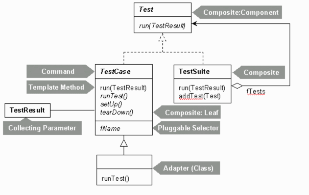

프로젝트 완성 설계도



프로젝트 진행 단계

1. log에 익숙해지기 assert function제작
   
   https://goddaehee.tistory.com/45

```java

public class TestMain {
    public static void main(String[] args){
        new TestMain().runTest();
    }
    public void runTest(){
        long sum = 10+10;
        Assert.assertTest(sum==20);
    }
}

```

단순 assert문 구현 및 메서드 실행 구현 

현재까지는 test framework라고 볼수없음.

2. 뼈대가 될 test 추상 클래스 제작

http://javacan.tistory.com/entry/6

커맨드 패턴 적용

run메서드를 통해서 모든 테스트를 조작할수있게 커맨드 패턴을 적용시켰습니다. 

```java

public abstract class Test {
    protected String testName;
    public Test(String testName){
        this.testName=testName;
    }
    public abstract void run();
}

```

->

```java
public class TestMain extends Test {
    public TestMain(String testName) {
        super(testName);
    }
    public static void main(String[] args){
        new TestMain("runTest").run();
    }
    public void runTest(){
        long sum = 10+10;
        Assert.assertTest(sum==20);
    }
    @Override
    public void run(){
        try{
            Method method = this.getClass().getMethod(super.testName,null);
            method.invoke(this,null);
        } catch(Exception e){
            throw new RuntimeException(e);
        }
    }
}


```

해당 추상 클래스를 상속받아서 run메서드를 완성했습니다.

또한 테스트마다 객체를 새로 할당해서 독립적으로 테스트가 진행될수 있게 구현했습니다.


또한 모든 테스트코드마다 공통적으로 구현될 run코드를 추상 클래스내로 이동시켜서 중복코드를 줄였습니다.

```java

public abstract class Test {
    protected String testName;
    private static final Logger logger = LoggerFactory.getLogger(Test.class);

    public Test(String testName) {
        this.testName = testName;
    }

    public void run() {
        try {
            logger.info("{} execute ", this.testName);
            Method method = this.getClass().getMethod(this.testName, (Class[])null);
            method.invoke(this, (Object[])null);
        } catch (Exception var2) {
            throw new RuntimeException(var2);
        }
    }
}

```


3. before, after 메서드 적용

```java

public void run(){
        before();
        runTest();
        after();
    }
    protected void before(){}
    protected void after(){}
    private void runTest(){
        try{
            logger.info("{} execute ",testName);
            Method method = this.getClass().getMethod(testName,null);
            method.invoke(this,null);
        } catch(Exception e){
            throw new RuntimeException(e);
        }
    }

```

템플릿메서드 패턴을 적용해서 추상클래스내에 before, after메서드를 정의하고 기존에 정의되어있던 run메서드내에 포함시키는것으로 구현할 수 있었습니다.


현재까지 구현된 구조입니다.

4. 결과 산출 기능 제작

Result 클래스

```java

public class TestResult {
    private static final Logger logger = LoggerFactory.getLogger(TestResult.class);
    private int runTestCount;
    public TestResult() {
        this.runTestCount = 0;
    }
    public synchronized void startTest() {
        this.runTestCount++;
    }
    public synchronized void renewCount(TestResult testResult) {
        this.runTestCount += testResult.getRunTestCount();
    }
    public int getRunTestCount(){
        return runTestCount;
    }
    public void printCount(){
        logger.info("Total Test Count: {}", runTestCount);
    }
}

```

Test추상 클래스내 result저장값 추가

```java

public abstract class Test {
    protected String testName;
    private TestResult testResult;
    private static final Logger logger = LoggerFactory.getLogger(Test.class);
    public Test(String testName){
        this.testName=testName;
    }
    public TestResult run(){
        getResultInstance();
        run(testResult);
        return testResult;
    }
    public void run(TestResult testResult){
        testResult.startTest();
        before();
        runTest();
        after();
    }
    private void getResultInstance(){
        try {
            if (testResult.equals(null)==true) {
                 testResult = new TestResult();
            }
        }catch (NullPointerException e){
            testResult = new TestResult();
        }
    }
    protected void before(){}
    protected void after(){}
    private void runTest(){
        try{
            logger.info("{} execute ",testName);
            Method method = this.getClass().getMethod(testName,null);
            method.invoke(this,null);
        } catch(Exception e){
            throw new RuntimeException(e);
        }
    }
}


```

기존에 사용되던 run을 오버로딩을 통해서 기존 testMain코드를 고치지않는 방향으로 진행해봤으나,

매 테스트마다 객체를 새로 생성해줘야 하기때문에 결국 main코드를 고쳐야하는 상황이 발생했습니다.

결국 메인클래스내에 result객체를 생성해서 값을 수집하는 콜렉팅 파라미터패턴을 적용했고, 해당 result객체를 넘겨서 직접 수정하거나 , 테스트마다 result객체를 생성해서 해당 result값을 return받아서 새롭게 갱신하는 두가지 방법이 있었습니다.

하지만 매번 갱신받는 방식은 모든 파라미터값에 대한 갱신 메서드를 구현해줘야 했고, 파라미터값으로 result객체를 넘기는 것이 최선이라 생각했습니다.

```java

public static void main(String[] args){
        TestResult testResult = new TestResult();
        testResult.renewCount(new TestMain("runTest").run());
        testResult.renewCount(new TestMain("runTest_2").run());
        testResult.printCount();
        /* run메서드 파라미터를 건드리는 경우
        TestResult testResult = new TestResult();
        new TestMain("runTest").run(testResult));
        new TestMain("runTest_2").run(testResult));
        testResult.printCount();
         */
    }

```

result객체에는 다양한 테스트객체가 접근하기때문에 thread-safe를 보장해주기 위해서 synchronized키워드를 달아줘야 했습니다.


5. 실패 및 오류 처리

```java

    public void run(TestResult testResult) {
        testResult.startTest();
        this.before();

        try {
            this.runTest();
        } catch (InvocationTargetException var7) {
            if (this.isAssertionFailed(var7)) {
                logger.info("into Exception1");
                testResult.addFailure(this);
            } else {
                testResult.addError(this, var7);
            }
        } catch (Exception var8) {
            testResult.addError(this, var8);
        } finally {
            this.after();
        }

    }

    private boolean isAssertionFailed(InvocationTargetException e) {
        return e.getTargetException() instanceof AssertionFailedError;
    }

    private void getResultInstance() {
        try {
            if (this.testResult.equals((Object)null)) {
                this.testResult = new TestResult();
            }
        } catch (NullPointerException var2) {
            this.testResult = new TestResult();
        }

    }

    private void runTest() throws InvocationTargetException, NoSuchMethodException, IllegalAccessException {
        logger.info("{} execute ", this.testName);
        Method method = this.getClass().getMethod(this.testName, (Class[])null);
        method.invoke(this, (Object[])null);
    }

```

테스트 실패시 AssertionFailedError를 발생시키게 되고 해당 에러는 InvocationTargetException을 통해서 발생하기 때문에 해당 예외를 catch해서 인스턴스 비교를 통해서 실제 오류 발생과 테스트 실패를 구분할 수 있었습니다.

```java

public synchronized void addFailure(Test test) {
        this.failures.add(new TestFailure(test));
    }

    public synchronized void addError(Test test, Exception e) {
        this.errors.add(new TestError(test, e));
    }
    
```

실패 혹은 에러시 해당 속성에 맞는 객체 생성후 리스트에 값을 추가시켰습니다

6. 테스트 단위 구분

현재까지 구현된 테스트는 개별로 객체를 생성해서 구현된 테스트이며 , 개별 테스트인지 그룹화된 테스트인지 자바는 알수가없습니다.

이를 위해서 테스트를 그룹핑해주는 객체를 생성했습니다.

```java

TestSuite testSuite = new TestSuite();
        TestResult testResult = new TestResult();
        testSuite.addTests(new TestMain("runTest"));
        testSuite.addTests(new TestMain("runTest_2"));
        testSuite.run(testResult);
        testResult.printCount();

```

```java

public class TestSuite{
   private List<Test> tests = new ArrayList<>();
   public void run(TestResult testResult){
      for (Test test : this.tests) {
         test.run(testResult);
      }
   }
   public void addTests(Test test){
      tests.add(test);
   }
}

    
```

구현 하고나니 run메서드를 따로 구현해줘야 했고 , 그룹별, 개인별 모두 적용할수있는 메서드를 구현할수는 없을까 고민했고 , Composite 패턴을 적용해서 test인터페이스를 통해 관리하면 한개의 인터페이스를 통해서 모두 관리가능할것 같다는 생각을 했습니다.

```java

public interface TestInterface {
    public void run(TestResult testResult);
}


```

인터페이스에는 run메서드 하나만을 포함하면 되고 나머지는 leaf클래스에서 확장해나가는 식으로 설계했습니다.

```java

public class TestSuite implements TestInterface{
   private List<Test> tests = new ArrayList<>();
   @Override
   public void run(TestResult testResult){
      for (Test test : this.tests) {
         test.run(testResult);
      }
   }
   public void addTests(Test test){
      tests.add(test);
   }
}

```

추가 구현사항

7. 애노테이션 기능 구현 및 assert기능 확장
